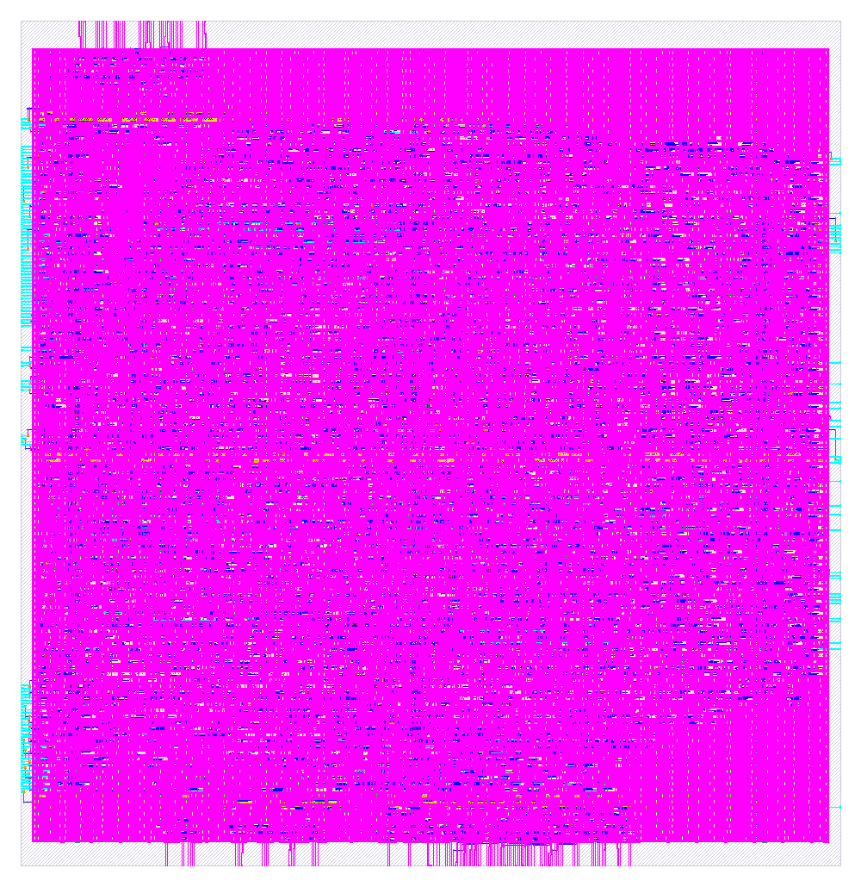

# jev_dot_pipe

`jev_dot_pipe` is a hardened hard macro for SkyWater SKY130 (`sky130_fd_sc_hd`). This package contains two views:

| File | What it is |
|---|---|
| `lef/jev_dot_pipe.lef` | Abstract physical view (LEF 5.7) for place and route |
| `vh/jev_dot_pipe.vh` | Verilog blackbox. Its signal ports match `rtl/jev_dot_pipe.v` |
| `rtl/jev_dot_pipe.v` / `rtl/jev_dot_pipe.vhd` | Generated RTL in Verilog and VHDL |
| `rtl/jev_dot_pipe_tb.v` / `rtl/jev_dot_pipe_tb.vhd` | Self-checking testbenches (8 golden vectors) |
| `gds/jev_dot_pipe.gds` | Hardened layout |
| `jev_dot_pipe.png` | Picture of that layout |
| `metrics.json` | Signoff metrics for the hardening run |
| `lib/` | Three nominal liberty files: ff at −40 °C 1.95 V, ss at 100 °C 1.60 V, tt at 25 °C 1.80 V |
| `librelane/config.json` | OpenLane config used for the run. Clock period 25 ns |

## Macro summary

| Property | Value |
|---|---|
| Class | `BLOCK` |
| Size | 366.545 µm × 377.265 µm (origin 0, 0) |
| Signal pins | 294 (260 input bits, 34 output bits) |
| Power | `VPWR` and `VGND`, 3 vertical met4 straps each, running y = 10.64 to 364.72 µm, and 3 horizontal met5 straps each |
| Pin layers | met2 on the north (40) and south (102) edges, met3 on the east (40) and west (112) edges |
| Obstructions | nwell, li1, and met1 cover the core. met2, met3, and met4 are partly blocked; see `OBS` in the LEF |
| Signoff | Corner `max_ss_100C_1v60`. Worst setup slack 4.492 ns. Worst hold slack 0.894 ns. Slew, capacitance, fanout, route DRC, Magic DRC, KLayout DRC, and LVS are 0 |

## Ports

| Port | Dir | Width | Notes |
|---|---|---|---|
| `clk` | in | 1 | Clock |
| `rst` | in | 1 | Synchronous reset, active high |
| `x0` to `x3` | in | 32 each | Four words to multiply |
| `w0` to `w3` | in | 32 each | Four words to multiply them by |
| `in_valid` | in | 1 | The eight words are offered |
| `out_ready` | in | 1 | The host is ready to take `result` |
| `in_ready` | out | 1 | High on the clock that accepts the fourth pair |
| `result` | out | 32 | Sum of the four products, low 32 bits |
| `out_valid` | out | 1 | `result` holds a finished sum |
| `VPWR`, `VGND` | inout | 1 | Only when `USE_POWER_PINS` is defined |



## How it works

This section was traced from the gate netlist in `rtl/jev_dot_pipe.v`. Products and sums are 32-bit, so the arithmetic wraps at 2^32.

**Four products, one per clock.** A 2-bit state picks the pair. State 0 multiplies `x0` by `w0`, state 1 multiplies `x1` by `w1`, state 2 multiplies `x2` by `w2`, and state 3 multiplies `x3` by `w3`. The multiply keeps the low 32 bits. While `in_valid` is high and the pipe has room, the state advances one step per clock, so a full dot product is four clocks.

**The sum.** Each product adds into a 32-bit accumulator. `result` is that sum. `out_valid` marks a finished sum, and `out_ready` is how the host takes it.

**Handshake.** `in_ready` is the accept for the set. It is high on the clock that takes the fourth pair, which is state 3, when `in_valid` is high and an internal stage is free. Reset clears the state and the datapath registers and loads the initial state.

## RTL

The RTL comes from the WASMApollo EDA (heapvm vgpu apollo), generated from the typed fabric `jev_dot_pipe`. The Verilog and VHDL are the same design.

| Property | Value |
|---|---|
| LUT4 cells | 37 |
| Word PEs | 18 |
| Registers | 18 |
| Combinational depth | 5 levels |
| Clocking | Single `clk`. Every register latches on the rising edge from the settled levels |
| Reset | `rst` is synchronous, active high, and loads the fabric's initial state |

### Microcode ROMs

Three small controller ROMs. Each maps a controller state to a select code (LSB first).

- `route_x`: state 0 selects `x0` (code `00`), state 1 selects `x1` (`01`), state 2 selects `x2` (`10`), state 3 selects `x3` (`11`).
- `route_w`: the same four states select `w0`, `w1`, `w2`, `w3`.
- `mac_op`: states 0 to 3 all select `mac` (code `1`).

## Simulation

Both testbenches are self-checking. Each vector holds `rst` for one cycle, runs 16 cycles, and then compares every output against the fabric's golden model (RefSim).

```sh
# Verilog (Icarus), from rtl/
iverilog -o tb jev_dot_pipe.v jev_dot_pipe_tb.v && vvp tb
# expected: PASS jev_dot_pipe: 8 vectors

# VHDL (GHDL), from rtl/
ghdl -a jev_dot_pipe.vhd jev_dot_pipe_tb.vhd && ghdl -e jev_dot_pipe_tb && ghdl -r jev_dot_pipe_tb
```

The VHDL testbench was run with GHDL and passes all 8 vectors. The Icarus command above is the Verilog run.

## Using the macro

### In RTL

```verilog
`include "jev_dot_pipe.vh"

jev_dot_pipe u_dot (
`ifdef USE_POWER_PINS
  .VPWR(vccd1),
  .VGND(vssd1),
`endif
  .clk(clk), .rst(rst),
  .x0(x0), .x1(x1), .x2(x2), .x3(x3),
  .w0(w0), .w1(w1), .w2(w2), .w3(w3),
  .in_valid(in_valid), .out_ready(out_ready),
  .in_ready(in_ready), .result(result), .out_valid(out_valid)
);
```

The blackbox file in this package is `vh/jev_dot_pipe.vh`. Define `USE_POWER_PINS` for power-aware simulation and LVS. Leave it undefined for plain RTL simulation.

### In OpenLane / OpenROAD

Add the LEF, the GDS, and the blackbox to your top-level config, for example:

```json
"EXTRA_LEFS": ["dir::lef/jev_dot_pipe.lef"],
"EXTRA_GDS_FILES": ["dir::gds/jev_dot_pipe.gds"],
"VERILOG_FILES_BLACKBOX": ["dir::vh/jev_dot_pipe.vh"]
```

Then connect `VPWR` and `VGND` to the power grid through the met4 and met5 straps. The GDS in this package is `gds/jev_dot_pipe.gds`.

## Other PDKs

The `VPWR`/`VGND` names belong to the hardened SKY130 view. To target another public PDK, synthesize `rtl/jev_dot_pipe.v` there and use that PDK's supply names. The LEF only applies to SKY130.
